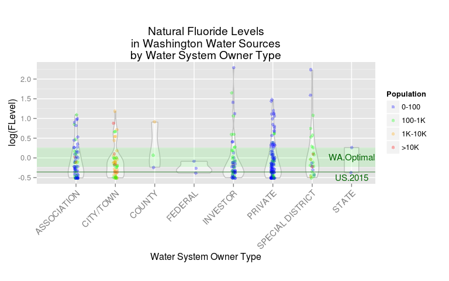
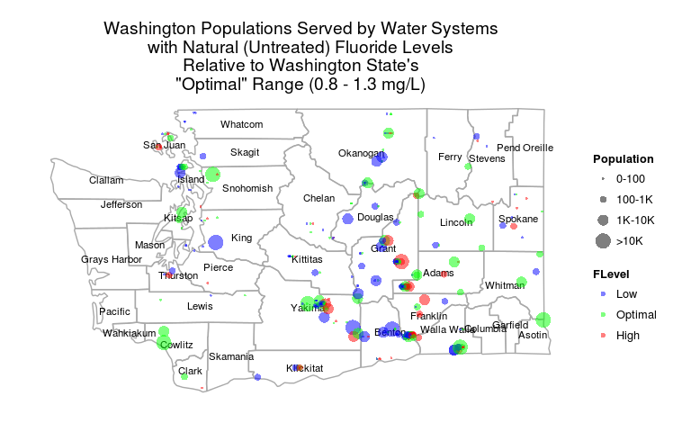
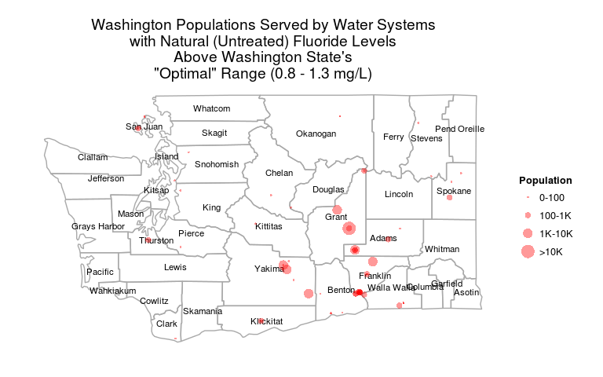

# Washington State Drinking Water Fluoridation
Brian High  
05/17/2015  

## Setup

Load the required R packages.


```r
for (pkg in c("knitr", "dplyr", "ggplot2", "maps")) {
    if (! suppressWarnings(require(pkg, character.only=TRUE)) ) {
        install.packages(pkg, repos="http://cran.fhcrc.org", dependencies=TRUE)
        if (! suppressWarnings(require(pkg, character.only=TRUE)) ) {
            stop(paste0(c("Can't load package: ", pkg, "!"), collapse = ""))
        }
    }
}
```

Configure `knitr` options.


```r
opts_chunk$set(tidy=FALSE, cache=FALSE)
```

Create the data folder if needed.


```r
datadir <- "data"
dir.create(file.path(datadir), showWarnings=FALSE, recursive=TRUE)
```

Read in the location coordinates from a text file if you have saved one 
previously.


```r
tsv_import <- function(filename) {
    infile <- paste(c(datadir, '/', filename), sep='', collapse='')
    if (file.exists(infile)) {
        read.delim(infile, stringsAsFactors=FALSE, header=TRUE)
    }
    else {
        stop(paste("Can't find", filename, "in folder", datadir, "!", sep=" "))
    }
}

locations <- tsv_import('wa_doh_dw_locations.tsv')
systems <- tsv_import('wa_doh_dw_systems.tsv')
fluoride <- tsv_import('wa_doh_dw_fluoride.tsv')
```

## Join Tables

Join the location and water system data into a new table for use in plotting.


```r
systems <- inner_join(locations, systems, by=c("PWSCity", "WSState", "WSZipCode"))
fl <- select(systems, PWSID, PWSCity, WSState, WSZipCode, 
                          OwnerTypeDesc, lon, lat)
fl$OwnerTypeDesc <- as.factor(fl$OwnerTypeDesc)

fl <- inner_join(fl, fluoride, by=c("PWSID"))
fl$Treatment <- as.factor(fl$Treatment)

# Add some grouping factors
fl$FLevel <- cut(fl$mgL, c(0,.8,1.3, Inf), labels=c("Low", "Optimal", "High"))
fl$Population <- cut(fl$ResPop, 
    c(0, 100, 1000, 10000, Inf), labels=c("0-100", "100-1K", "1K-10K", ">10K"))

nat.fl <- filter(fl, Treatment == "NATURAL")
nat.fl <- select(nat.fl, County, PWSID, SystemName, mgL, ResPop, OwnerTypeDesc, 
                 lon, lat, Treatment, FLevel, Population)

nat.fl <- nat.fl[complete.cases(nat.fl),]

nat.fl.high <- nat.fl[nat.fl$mgL>1.3,]
nat.fl.high <- nat.fl.high[complete.cases(nat.fl.high),]
```

## Violin Plot of Natural Fluoride Levels

Make a violin plot of fluoride levels by system owner type.


```r
ggplot(nat.fl, aes(x=OwnerTypeDesc, y=log(mgL))) + 
    geom_violin(alpha=0.5, color="gray") + geom_jitter(size=2, alpha=0.3,
      position = position_jitter(width = 0.05), aes(color=Population)) +
    theme(axis.text.x = element_text(angle=45, vjust=1, size=11, hjust=1)) +
    scale_color_manual(values=c("blue", "green", "orange", "red")) + 
    coord_equal() + 
    labs(title=paste("Natural Fluoride Levels", "in Washington Water Sources", 
                     "by Water System Owner Type", sep="\n"), 
        x="Water System Owner Type", y = "log(FLevel)") +
    geom_rect(data=nat.fl[1,], 
              aes(ymin=log(.8), ymax=log(1.3), xmin=0, xmax=Inf), 
              fill="green", alpha=.1, label="Optimal Fluoridation") + 
    geom_text(aes(8, 0, label="WA.Optimal", group=NULL), size = 4, 
        color = "darkgreen", data=nat.fl[1,], parse = T) + 
    geom_hline(aes(yintercept=log(0.7), alpha=.5), color = "darkgreen") + 
    geom_text(aes(8, -.5, label="US.2015", group=NULL), size = 4, 
        color = "darkgreen", data=nat.fl[1,], parse = T) +
    guides(col = guide_legend(reverse = FALSE))
```

 

## Prepare Map Data

Prepare the map data.frame.


```r
# Capitalize first letter of word - for use with proper nouns
# From documentation for `tolower` in package _base_ 3.1.3
capwords <- function(s, strict = FALSE) {
    cap <- function(s) paste(toupper(substring(s, 1, 1)),
                  {s <- substring(s, 2); if(strict) tolower(s) else s},
                             sep = "", collapse = " " )
    sapply(strsplit(s, split = " "), cap, USE.NAMES = !is.null(names(s)))
}

# Mappings of counties by state
county_df <- map_data('county')

# Subset just for WA
wa <- subset(county_df, region=="washington")
wa$subregion <- sapply(wa$subregion, function(x) capwords(x))
wa$county <- wa$subregion
cnames <- aggregate(cbind(long, lat) ~ subregion, data=wa, 
                    FUN=function(x)mean(range(x)))

# Create the state map with counties outlined in grey
wamap <- ggplot(wa, aes(long, lat)) +  
    geom_polygon(aes(group=group), color='darkgrey', fill=NA) +
    geom_text(data=cnames, aes(long, lat, label = subregion), size=3) + 
    theme_classic()  + 
    theme(axis.line=element_blank(),
      axis.text.x=element_blank(),
      axis.text.y=element_blank(),
      axis.ticks=element_blank(),
      axis.title.x=element_blank(),
      axis.title.y=element_blank())
```

## Untreated: Natural Fluoride Levels

Make a map of populations served by water systems with natural fluoride levels.


```r
wamap + geom_point(data=nat.fl, inherit.aes=F, 
        aes(x=lon, y=lat, group=FLevel, color=FLevel, size=Population, 
            fill=FLevel), 
        position=position_jitterdodge(jitter.width=0.1, dodge.width=0.1), 
        alpha=.5) + scale_shape_discrete(solid=T) + 
    scale_color_manual(values=c("blue", "green", "red")) + 
    ggtitle(label = paste("Washington Populations Served by Water Systems",
                          "with Natural (Untreated) Fluoride Levels", 
                          "Relative to Washington State's",
                          "\"Optimal\" Range (0.8 - 1.3 mg/L)", sep="\n"))
```

 

## Natural: Exceeding Optimal Fluoride Levels

Make a map of populations served by water systems with natural fluoride levels 
above Washington State's "optimal" range of 0.8 - 1.3 mg/L.


```r
wamap + geom_point(data=nat.fl.high, inherit.aes=F, 
               aes(x=lon, y=lat, size=Population), colour="red", alpha=.4) +
    ggtitle(label = paste("Washington Populations Served by Water Systems",
                          "with Natural (Untreated) Fluoride Levels", 
                          "Above Washington State's",
                          "\"Optimal\" Range (0.8 - 1.3 mg/L)", sep="\n"))
```

 

## All Systems: Optimal and Nonoptimal Fluoride Levels

Make a map of populations served by water systems with natural or treated 
fluoride levels falling inside or outside of Washington State's "optimal" range 
of 0.8 - 1.3 mg/L.


```r
fl$Optimal <- with(fl, Treatment=="TREATED" | Treatment=="INTERTIED" | FLevel == "Optimal")
fl$Optimal <- factor(c('No', 'Yes')[fl$Optimal + 1])
fl.opt <- select(fl, County, PWSID, SystemName, ResPop, OwnerTypeDesc, 
                 lon, lat, Treatment, Population, Optimal)
fl.opt <- fl[complete.cases(fl.opt),]

wamap + geom_point(data=fl.opt, inherit.aes=F, 
               aes(x=lon, y=lat, size=Population, color=Optimal), alpha=.4) +
    scale_color_manual(values=c("red", "green")) +
    ggtitle(label = paste("Washington Populations Served by Water Systems",
                          "with Fluoride Levels Relative to Washington State's",
                          "\"Optimal\" Range (0.8 - 1.3 mg/L)", sep="\n"))
```

 

