# Washington State Drinking Water Fluoridation
Brian High  
05/21/2015  

<a rel="license" href="http://creativecommons.org/licenses/by-sa/4.0/"></a><br />This work is licensed under a <a rel="license" href="http://creativecommons.org/licenses/by-sa/4.0/">Creative Commons Attribution-ShareAlike 4.0 International License</a>.

## Introduction

This exploratory data analysis tutorial explores the use of publicly available 
data to investigate drinking water system fluoride levels in Washington State. 
Methods for reproducible data cleanup and exploratory analysis using R, RMarkdown, 
and `knitr`, will be demonstrated, as well as some of the plotting capabilities 
of R, especially `ggplot2`.

We will compare the various water systems in Washington State relative to the
state and federal recommendations for optimum levels of fluoride concentation 
in drinking water. 

According to the US CDC, lower levels of fluoride 
[help prevent tooth decay](http://www.cdc.gov/fluoridation/index.htm), but 
higher levels increase the risk of 
[dental fluorosis](http://www.cdc.gov/fluoridation/safety/dental_fluorosis.htm).

In April 2015, the 
[US HHS](http://www.hhs.gov/news/press/2015pres/04/20150427a.html) 
("Health Department") released a lowering of the recommended fluoride 
concentration in driking water from the previous range of 0.7 to 1.2 mg/L to 
the new level of 0.7 mg/L, which falls below Washington State's 
[DOH](http://www.doh.wa.gov/DataandStatisticalReports/EnvironmentalHealth/DrinkingWaterSystemData/FluorideinDrinkingWater) 
"optimal" range of 0.8 to 1.3 mg/L.

If Washington State follows this new recommendation, what changes would need to 
be made to the state's drinking water systems? 

## Data Sources

Data files have been prepared using a companion 
[Markdown script](https://github.com/brianhigh/wa-water-quality/blob/master/data_cleanup_and_export.md) 
to generate text data files. These data and Markdown files are hosted in the 
[wa-water-quality](https://github.com/brianhigh/wa-water-quality) repository 
on [GitHub](https://github.com). (https://github.com/brianhigh/wa-water-quality)

The water system data come from [WA DOH Water System Data](http://www.doh.wa.gov/DataandStatisticalReports/EnvironmentalHealth/DrinkingWaterSystemData/DataDownload) (2015) and [WA DOH Fluoride in Drinking Water](http://www.doh.wa.gov/DataandStatisticalReports/EnvironmentalHealth/DrinkingWaterSystemData/FluorideinDrinkingWater) (2013). The lat/long coordinates were generated using the [ggmap](http://journal.r-project.org/archive/2013-1/kahle-wickham.pdf) package for R. The federally recommended 
fluoride levels come from the [US HHS](http://www.hhs.gov/news/press/2015pres/04/20150427a.html) 
("Health Department") and [US EPA](http://water.epa.gov/drink/contaminants/basicinformation/fluoride.cfm#four).

## Setup

Load the required R packages.


```r
for (pkg in c("knitr", "dplyr", "lattice", "ggplot2", "gridExtra", "maps")) {
    if (! suppressWarnings(require(pkg, character.only=TRUE)) ) {
        install.packages(pkg, repos="http://cran.fhcrc.org", dependencies=TRUE)
        if (! suppressWarnings(require(pkg, character.only=TRUE)) ) {
            stop(paste0(c("Can't load package: ", pkg, "!"), collapse = ""))
        }
    }
}
```

Configure `knitr` options.


```r
opts_chunk$set(tidy=FALSE, cache=TRUE)
```

Create the data folder, if necessary.


```r
datadir <- "data"
dir.create(file.path(datadir), showWarnings=FALSE, recursive=TRUE)
```

Read in the location coordinates from a text file if you have saved one 
previously.


```r
tsv_import <- function(filename) {
    infile <- paste(c(datadir, '/', filename), sep='', collapse='')
    if (file.exists(infile)) {
        read.delim(infile, stringsAsFactors=FALSE, header=TRUE)
    }
    else {
        stop(paste("Can't find", filename, "in folder", datadir, "!", sep=" "))
    }
}

locations <- tsv_import('wa_doh_dw_locations.tsv')
systems <- tsv_import('wa_doh_dw_systems.tsv')
sources <- tsv_import('wa_doh_dw_sources.tsv')
```

```
## Warning in scan(file, what, nmax, sep, dec, quote, skip, nlines,
## na.strings, : EOF within quoted string
```

```r
fluoride <- tsv_import('wa_doh_dw_fluoride.tsv')
```

## Join Tables

Join the location and water system data into a new table for use in plotting.


```r
systems <- inner_join(locations, systems, by=c("PWSCity", "WSState", "WSZipCode"))
fl <- select(systems, PWSID, PWSCity, WSState, WSZipCode, 
                          OwnerTypeDesc, lon, lat)
fl$OwnerTypeDesc <- as.factor(fl$OwnerTypeDesc)

fl <- inner_join(fl, fluoride, by=c("PWSID"))
fl$Treatment <- as.factor(fl$Treatment)

# Add some grouping factors
fl$F.Level <- cut(fl$mgL, c(0, .8, 1.3, Inf), 
                  labels=c("Below", "Optimal", "Above"))
fl$Population <- cut(fl$ResPop, 
    c(0, 100, 1000, 10000, Inf), labels=c("0-100", "100-1K", "1K-10K", ">10K"))

nat.fl <- filter(fl, Treatment == "NATURAL")
nat.fl <- select(nat.fl, County, PWSID, SystemName, mgL, ResPop, OwnerTypeDesc, 
                 lon, lat, Treatment, F.Level, Population)

nat.fl <- nat.fl[complete.cases(nat.fl),]
```

## Exploratory Data Analysis

We'll look at Washington State Drinking Water Systems with natural 
(non-fluoridated) fluoride levels (concentration in mg/L) using plots and 
summary tables.

### Scatter Plots

Let's get a first look at the data with some scatter plots. This `pairs` plot 
of fluoride levels (mg/L), residential population (ResPop), and system owner 
type descriptions (OwnerTypeDesc) shows some potentially interesting 
relationships.


```r
pairs(nat.fl[4:6], panel = panel.smooth)
```

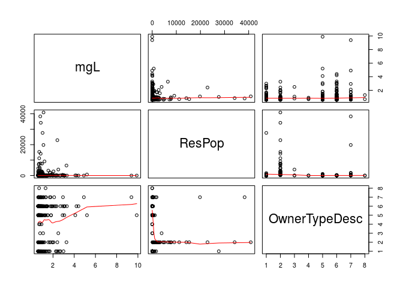 

To spead out the lower values, use a log scale.


```r
pairs(nat.fl[4:6], panel = panel.smooth, log="xy")
```

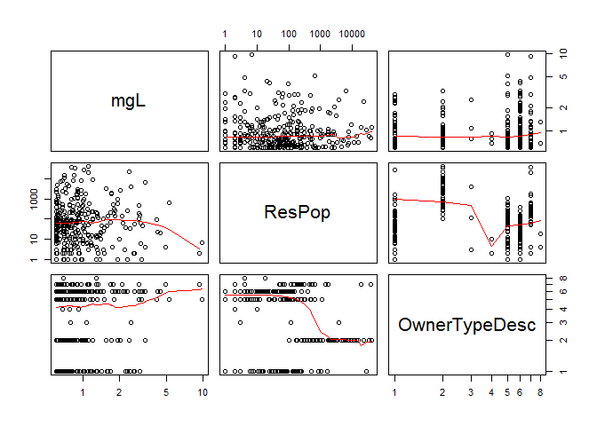 

It appears that the untreated water systems serving larger residential 
populations might have lower natural fluoride levels. Let's look at that a
little closer. We'll use `qplot`, which is the simpler interface to the 
`ggplot2` package.


```r
qplot(ResPop, mgL, data=nat.fl, geom=c("point", "smooth"), method="lm", 
      facets=~OwnerTypeDesc, log = "xy")
```

 

The [special district](http://mrsc.org/Home/Explore-Topics/Governance/Forms-of-Government-and-Organization/Special-Purpose-Districts-in-Washington.aspx) 
owner type seems to be the only one showing at least a marginally significant 
correlation between natural fluoride levels and residential population.


```r
summary(lm(mgL~ResPop+OwnerTypeDesc, data=nat.fl))
```

```
## 
## Call:
## lm(formula = mgL ~ ResPop + OwnerTypeDesc, data = nat.fl)
## 
## Residuals:
##     Min      1Q  Median      3Q     Max 
## -0.9206 -0.4278 -0.2894  0.0380  8.6689 
## 
## Coefficients:
##                                 Estimate Std. Error t value Pr(>|t|)    
## (Intercept)                    1.028e+00  1.237e-01   8.312 3.03e-15 ***
## ResPop                        -1.250e-06  1.311e-05  -0.095   0.9241    
## OwnerTypeDescCITY/TOWN        -1.749e-02  1.964e-01  -0.089   0.9291    
## OwnerTypeDescCOUNTY            4.252e-01  5.835e-01   0.729   0.4667    
## OwnerTypeDescFEDERAL          -2.378e-01  5.834e-01  -0.408   0.6838    
## OwnerTypeDescINVESTOR          1.933e-01  1.791e-01   1.079   0.2815    
## OwnerTypeDescPRIVATE           8.535e-02  1.549e-01   0.551   0.5820    
## OwnerTypeDescSPECIAL DISTRICT  4.929e-01  2.280e-01   2.162   0.0314 *  
## OwnerTypeDescSTATE            -3.283e-02  7.092e-01  -0.046   0.9631    
## ---
## Signif. codes:  0 '***' 0.001 '**' 0.01 '*' 0.05 '.' 0.1 ' ' 1
## 
## Residual standard error: 0.9876 on 309 degrees of freedom
## Multiple R-squared:  0.02182,	Adjusted R-squared:  -0.003504 
## F-statistic: 0.8616 on 8 and 309 DF,  p-value: 0.5493
```

Let's zoom in on "special district" water systems with `qplot`.


```r
# Filter by "special district" water system owner type
nat.fl.special <- filter(nat.fl, OwnerTypeDesc=="SPECIAL DISTRICT")

# Plot points with a linear regression line
qplot(ResPop, mgL, data=nat.fl.special, geom=c("point", "smooth"), method="lm", 
      log = "xy")
```

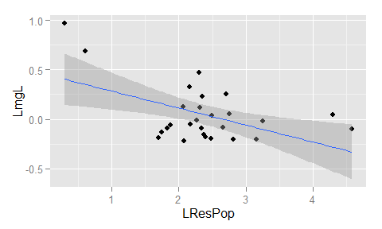 

Perhaps the smaller systems are less inclined (or less able) to adjust fluoride 
levels. We see there are two in particular with very high fluoride and very low 
population.

Incidentally, we can make this same plot with `ggplot`, the more advanced 
interface to the `ggplot2` package.


```r
ggplot(nat.fl.special, aes(ResPop, mgL)) + geom_point() + 
    geom_smooth(method="lm") + scale_x_log10() + scale_y_log10()
```

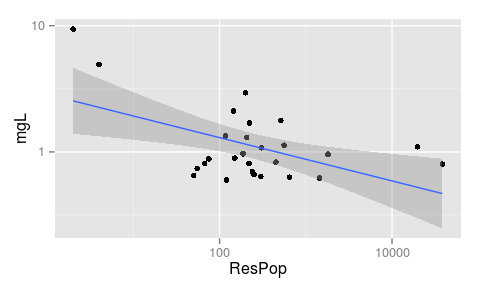 

Let's take a look at those top-2 highest-fluoride "special district" water systems.


```r
nat.fl.special %>% select(SystemName, mgL, ResPop) %>% arrange(desc(mgL)) %>% head(2)
```

```
##                        SystemName  mgL ResPop
## 1      PATERSON ELEMENTARY SCHOOL 9.39      2
## 2 DODD ROAD INDUSTRIAL PARK WATER 4.91      4
```

So, the two "special district" water systems with the highest fluoride 
concentrations serve just a few residential users. What other systems have high
natural fluoride? How high is "too high"?

## Untreated Fluoride Levels over EPA MCL

The [US EPA](http://water.epa.gov/drink/contaminants/basicinformation/fluoride.cfm#four)'s 
MCLG (maximum contaminant level goal) of 4 mg/L. This is also the level of the 
EPA's enforceable MCL (maximum contaminant level).

Which systems are over the EPA MCL of 4 mg/L?


```r
nat.fl.over <- filter(nat.fl, mgL > 4)
nat.fl.over[order(nat.fl.over$mgL), 
            c("SystemName", "OwnerTypeDesc", "ResPop", "mgL")]
```

```
##                          SystemName    OwnerTypeDesc ResPop  mgL
## 6                  WESTBOURNE ACRES         INVESTOR     94 4.10
## 1                      FROSTY PINES          PRIVATE     24 4.21
## 7          DALLES WATER ASSOCIATION          PRIVATE     21 4.40
## 4   DODD ROAD INDUSTRIAL PARK WATER SPECIAL DISTRICT      4 4.91
## 5 HARRISON-RAY-BURBANK WATER SYSTEM         INVESTOR    656 5.20
## 2        PATERSON ELEMENTARY SCHOOL SPECIAL DISTRICT      2 9.39
## 3       LONG LAKE OPERATORS VILLAGE         INVESTOR      7 9.89
```

One of the highest levels (9.39 mg/L) is at 
[Paterson Elementary School](http://www.patersonschool.org/). That's over twice 
the EPA's regulatory limit of 4 mg/L. Looking at the 
[ResPop](http://www.doh.wa.gov/DataandStatisticalReports/EnvironmentalHealth/DrinkingWaterSystemData/DataDownload/DataTerms) column, the table lists the population as 2, 
yet the school's population of students is over 100 according to Washington 
[OSPI](http://reportcard.ospi.k12.wa.us/summary.aspx?schoolId=368&OrgType=4&reportLevel=School). 
What are the school's water sources?


```r
sources[sources$SystemName=="PATERSON ELEMENTARY SCHOOL", 
        c("SystemName", "Src_Name", "TrObjective", "TrProcss")]
```

```
##                      SystemName Src_Name TrObjective TrProcss
## 4935 PATERSON ELEMENTARY SCHOOL  WELL #1                     
## 4936 PATERSON ELEMENTARY SCHOOL  WELL #2
```

It looks like there is no treatment information available about those two wells.

Let's plot the water systems with fluoride levels over the EPA MCL as a simple 
bar plot with `ggplot`, using the `theme_light` theme, coloring by system owner 
type, and flipping the coordinates to accommodate the long water system names.


```r
ggplot(nat.fl.over, aes(x=SystemName, y=mgL, fill=OwnerTypeDesc)) + coord_flip() +
    geom_bar(stat="identity", colour="black", binwidth=1) +  
    ggtitle(paste("Washington State Drinking Water Systems",
                  "Exceeding EPA MCL of 4 mg/L", sep="\n")) +
    theme(axis.text.y = element_text(hjust = 1, size=10)) + theme_light() +
    labs(y="Fluoride Level (mg/L)", x=NULL)+ scale_fill_brewer(palette="Set2")
```

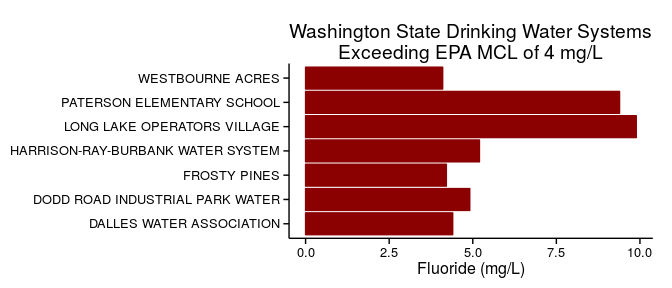 

### Box Plots

Here is a basic boxplot of the fluoride level (concentration in mg/L) by water 
system owner type description (OwnerTypeDesc).


```r
# Make a basic boxplot of mgL by Water System Owner Type
par(cex.axis=.55)
boxplot(mgL~OwnerTypeDesc, data=nat.fl)
```

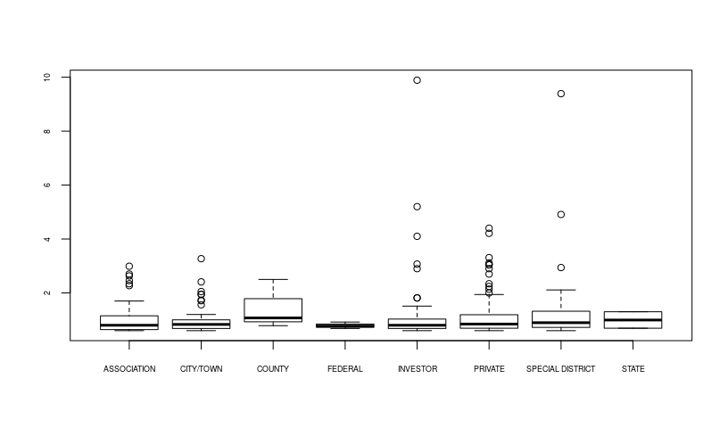 

As there is a lot of spread at the higher fluoride levels, we'll try again using 
a log scale for the y-axis.


```r
# Make a basic boxplot of mgL by Water System Owner Type
par(cex.axis=.55)
boxplot(mgL~OwnerTypeDesc, data=nat.fl, log="y")
```

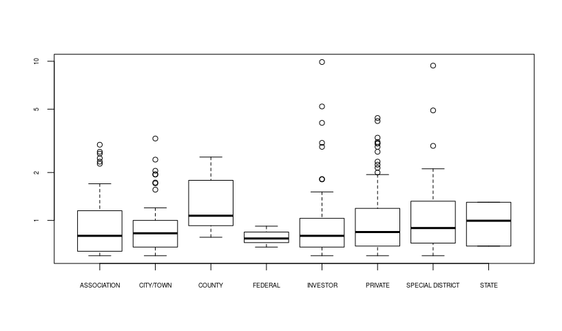 

As an alternative to the standard "base" plotting in R, we can use the `lattice`
plotting system. Here is a boxplot faceted by residental population groups
served by the water systems.


```r
bwplot(nat.fl$mgL~nat.fl$OwnerTypeDesc|nat.fl$Population,
        ylab="log(Fluoride Level)", xlab="Water System Owner Type", log="y",
        main="Fluoride Level by Water System Owner Type and Population",
        layout=(c(1,4)))
```

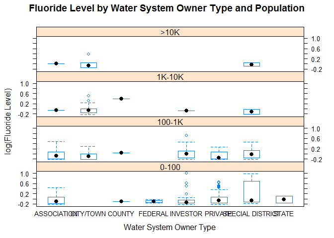 

Next, let's swap the axes and try a different layout. We'll also use the 
`with` function so we don't have to keep repeating the name of the data.frame 
when we refer to column names.


```r
with(nat.fl, bwplot(OwnerTypeDesc~mgL|Population,
        xlab="log(Fluoride Level)", ylab="Water System Owner Type", log="x",
        main="Fluoride Level by Water System Owner Type and Population",
        layout=(c(2,2))))
```

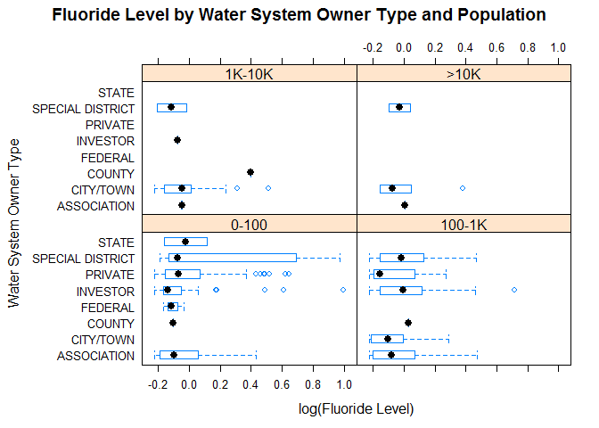 

One of the most popular plotting systems in R is the versatile `ggplot2` 
package, which we used earlier with scatter and bar plots. The rest of the plots 
in this document will be created with `ggplot`.

Here is a [faceted](http://www.cookbook-r.com/Graphs/Facets_%28ggplot2%29/) 
plot like the previous one (2x2), without the coordinate swap, and this time 
made using the `ggplot` function.


```r
# Use light theme, 45-degre x-axis lables, smaller outlier dots, and 2x2 facet
ggplot(nat.fl, aes(x=OwnerTypeDesc, y=mgL)) + scale_y_log10() +
    facet_wrap(~Population) +
    labs(title=paste("Natural Fluoride Levels", "in Washington Water Sources", 
                     "by Water System Owner Type", sep="\n"), 
        x="Water System Owner Type", y = "log(Fluoride Level)") +
        theme_light() + 
    theme(axis.text.x = element_text(size=8, angle=45, hjust=1, vjust=1)) +
    geom_boxplot(outlier.size=1)
```

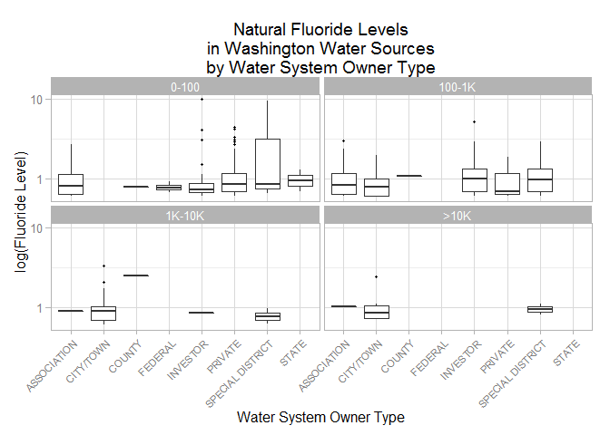 

Let's start over again with the basic boxplot. We will store the essential 
parameters of this next plot to build upon later as we add more features to the 
plot. For the sake of tidiness, order the boxplots by increasing median levels.


```r
# Reorder by median fluoride level (boxplot center)
nat.fl <- group_by(nat.fl, OwnerTypeDesc)
owner.levels <- summarise(nat.fl, median.mgL.by.owner=median(mgL)) %>% 
    arrange(median.mgL.by.owner) %>% select(OwnerTypeDesc)
nat.fl$OwnerTypeDesc <- factor(nat.fl$OwnerTypeDesc, levels=owner.levels$OwnerTypeDesc)

# Use light theme, smaller x-asis lables, and use smaller outlier dots
plot <- ggplot(nat.fl, aes(x=OwnerTypeDesc, y=mgL)) + scale_y_log10() +
    labs(title=paste("Natural Fluoride Levels", "in Washington Water Sources", 
                     "by Water System Owner Type", sep="\n"), 
        x="Water System Owner Type", y = "log(Fluoride Level)") +
        theme_light() + theme(axis.text.x = element_text(size=10, 
                                                         angle=20, vjust=.6))

plot + geom_boxplot(outlier.size=1)
```

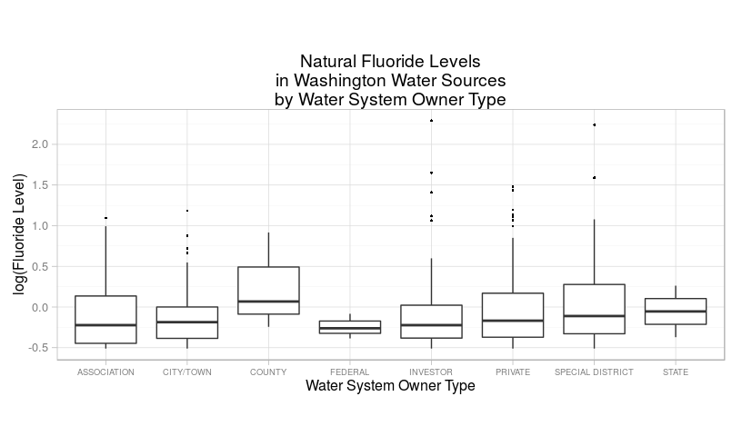 

We can use color instead of faceting to represent the population groups.

We'll also add data points with jitter and remove the (now redundant) black 
outlier dots.


```r
# Add jittered and population-colored points
plot <- plot + geom_jitter(size=3, alpha=0.4, 
    position = position_jitter(width = 0.05), aes(color=Population)) +
    scale_color_manual(values=c("darkblue", "darkgreen", "darkorange", "darkred"))

plot + geom_boxplot(alpha=0, outlier.size=0)
```

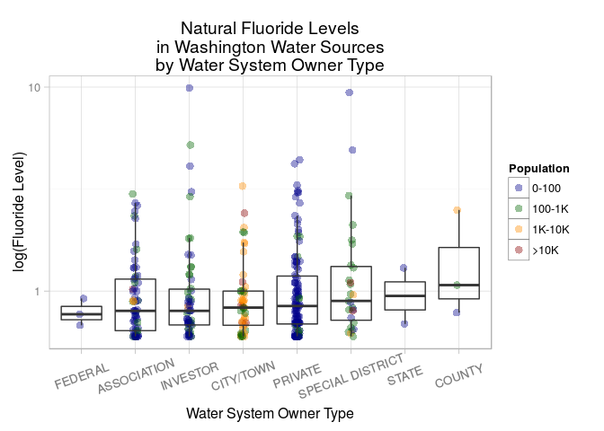 

Add a light-green horizontal band to show the optimal fluoride level range and 
add a label for it.


```r
# Add a rectangle for the optimal fluoride level range and a label for it
plot <- plot + geom_rect(data=nat.fl[1,], 
              aes(ymin=.8, ymax=1.3, xmin=0, xmax=Inf), 
              fill="green", alpha=.2, label="Optimal Fluoridation") + 
    annotate("text", x=.74, y=1.15, label="WA Optimal", size = 4, color = "darkgreen")

plot + geom_boxplot(alpha=0, outlier.size=0)
```

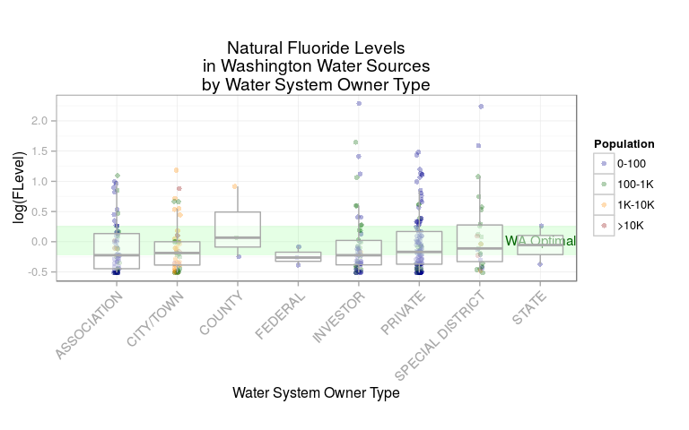 

Add lines (and labels) for the various US HHS and EPA levels.


```r
# Add lines (and labels) for the various US HHS and EPA levels
plot <- plot + geom_hline(aes(yintercept=0.7, alpha=.5), color = "darkgreen") +
    annotate("text", x=.65, y=.6, label="HHS 2015", size = 4, color = "darkgreen") +
    geom_hline(aes(yintercept=2, alpha=.5), color = "darkorange") + 
    annotate("text", x=.73, y=1.8, label="EPA SMCL", size = 4, color = "darkorange") +
    geom_hline(aes(yintercept=4, alpha=.5), color = "darkred") + 
    annotate("text", x=.65, y=3.6, label="EPA MCL", size = 4, color = "darkred")

plot + geom_boxplot(alpha=0, outlier.size=0)
```

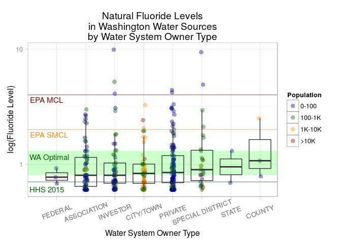 

## Violin Plot of Natural Fluoride Levels

Make a violin plot of fluoride levels by system owner type. A violin plot is 
something like a box plot, except the width of the "violin" shape varies with 
the density of observations at each point along the y-axis. This will help us
see density differences where the dots overlap.


```r
# Make the violin plot
plot + geom_violin(alpha=0)
```

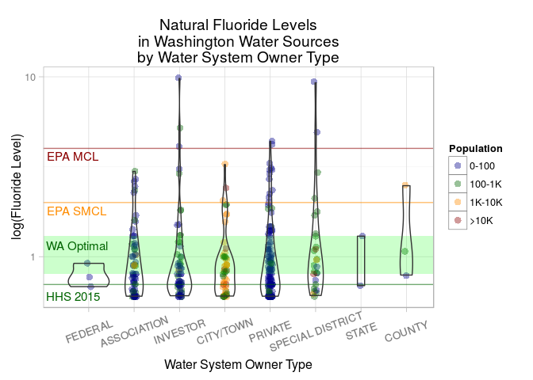 

The colors indicate the size of the population served by the water system. The 
width of the shapes vary according to the density of points plotted at a given 
fluoride level. 

The light green band shows Washington's range of "optimal" fluoride levels (0.8 
to 1.3 mg/L). The green line marks the new (April, 2015) 
[US HHS](http://www.hhs.gov/news/press/2015pres/04/20150427a.html) 
[recommended](http://www.cdc.gov/fluoridation/faqs/) level of 0.7 mg/L. 

The red line marks the level of the 
[US EPA](http://water.epa.gov/drink/contaminants/basicinformation/fluoride.cfm#four)'s 
MCLG (maximum contaminant level goal) of 4 mg/L. This is also the level of the 
EPA's enforceable MCL (maximum contaminant level). The orange line marks the 
level of the [US EPA](http://water.epa.gov/drink/contaminants/basicinformation/fluoride.cfm#four)'s 
SMCL (secondary standard) of 2 mg/L, a non-enforceable guideline. 

For completeness, we'll add a footnote referencing the data sources.


```r
# Make the violin plot with data source attribution

plot <- plot + geom_violin(alpha=0)

data.src <- paste0(collapse = ' ', c('Data sources:', 
                    'WA DOH (www.doh.wa.gov),', 
                    'US EPA (water.epa.gov)',
                    'and HHS (www.hhs.gov)'))
gplot <- arrangeGrob(plot, sub = textGrob(data.src, x=0, hjust=-0.1, vjust=0.1,
                   gp = gpar(fontface="italic", fontsize=10)))
gplot
```

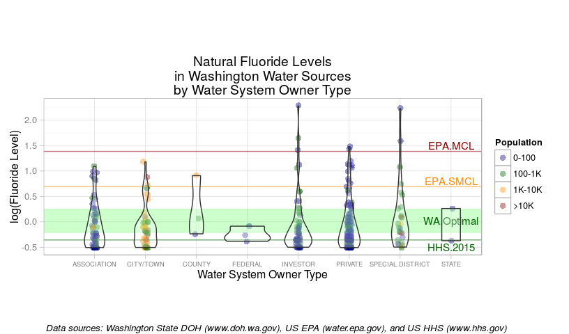 

## Prepare Map Data

Before we plot the water systems on a map, we will need to get a state map with
county names and boundaries.

Prepare the map `data.frame` using the `map_data` function from the `ggplot2`
package.


```r
# Capitalize first letter of word - for use with proper nouns
# From documentation for `tolower` in package _base_ 3.1.3
capwords <- function(s, strict = FALSE) {
    cap <- function(s) paste(toupper(substring(s, 1, 1)),
                  {s <- substring(s, 2); if(strict) tolower(s) else s},
                             sep = "", collapse = " " )
    sapply(strsplit(s, split = " "), cap, USE.NAMES = !is.null(names(s)))
}

# Mappings of counties by state
county_df <- map_data('county')

# Subset just for WA
wa <- subset(county_df, region=="washington")
wa$subregion <- sapply(wa$subregion, function(x) capwords(x))
wa$county <- wa$subregion
cnames <- aggregate(cbind(long, lat) ~ subregion, data=wa, 
                    FUN=function(x)mean(range(x)))
write.csv(cnames, file='data/cnames.csv', row.names=FALSE)
```

This allows us to create a base state map with county border in grey that we 
will build upon later. We'll use the `theme_classic()` theme.


```r
# Create the base state map with counties outlined in grey
wamap <- ggplot(wa, aes(long, lat)) +  
    geom_polygon(aes(group=group), color='darkgrey', fill=NA) +
    geom_text(data=cnames, aes(long, lat, label = subregion), size=3) + 
    theme_classic()  + 
    theme(axis.line=element_blank(),
      axis.text.x=element_blank(),
      axis.text.y=element_blank(),
      axis.ticks=element_blank(),
      axis.title.x=element_blank(),
      axis.title.y=element_blank())
wamap
```

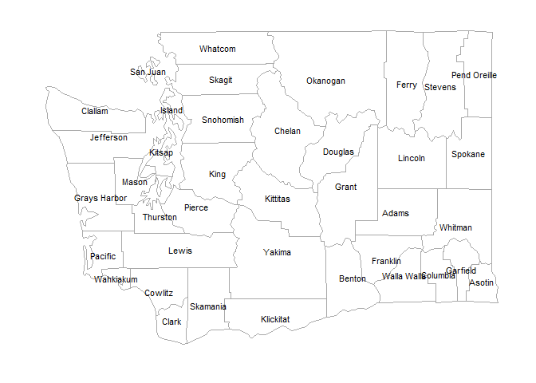 

## Untreated Systems Exceeding Optimal Fluoride Levels

Make a map of populations Served by Drinking Water Systems with natural 
fluoride levels above Washington State's "optimal" range of 0.8 - 1.3 mg/L.


```r
# Subset the data
nat.fl.high <- nat.fl[nat.fl$mgL>1.3,]
nat.fl.high <- nat.fl.high[complete.cases(nat.fl.high),]

# Make the map
wamap + geom_point(data=nat.fl.high, inherit.aes=FALSE, 
               aes(x=lon, y=lat, size=Population), colour="darkred", alpha=.3) +
        scale_size_manual(values = seq(3, 12, by=2)) +
    guides(colour = guide_legend(override.aes = list(size=5))) + 
    ggtitle(label = paste("Washington Populations Served by Drinking Water Systems",
                          "with Natural (Untreated) Fluoride Levels", 
                          "Above Washington State's",
                          "\"Optimal\" Range (0.8 - 1.3 mg/L)", sep="\n"))
```

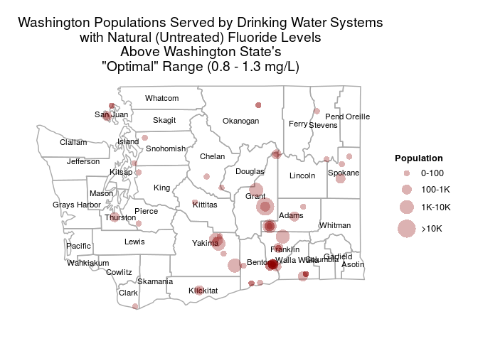 

## Untreated Natural Fluoride Levels

Make a map of populations served by non-fluoridated water systems with natural 
fluoride levels.


```r
# Make the map
wamap + geom_point(data=nat.fl, inherit.aes=FALSE, 
            aes(x=lon, y=lat, group=F.Level, color=F.Level, size=Population, 
                fill=F.Level), 
        position=position_jitterdodge(jitter.width=0.1, dodge.width=0.1), 
        alpha=.3) + scale_shape_discrete(solid=T) + 
    scale_size_manual(values = seq(3, 12, by=2)) +
    scale_color_manual(values=c("darkblue", "darkgreen", "darkred")) + 
    guides(colour = guide_legend(override.aes = list(size=5))) + 
    ggtitle(label = paste("Washington Populations Served by Drinking Water Systems",
                          "with Natural (Untreated) Fluoride Levels", 
                          "Colored Relative to Washington State's",
                          "\"Optimal\" Range (0.8 - 1.3 mg/L)", sep="\n"))
```

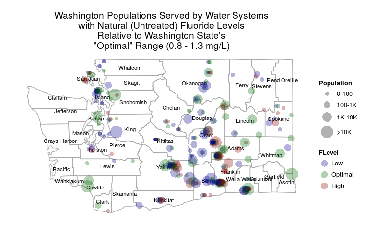 

## All Systems: Optimal and Nonoptimal Fluoride Levels

Make a map of populations Served by Drinking Water Systems with natural or treated 
fluoride levels falling inside or outside of Washington State's "optimal" range 
of 0.8 - 1.3 mg/L.


```r
# Assign Optimal as T/F based on fluoride concentrations (mgL) and system type
fl$Optimal <- with(fl, Treatment=="TREATED" | Treatment=="INTERTIED" | F.Level=="Optimal")

# Convert T/F to Yes/No
fl$Optimal <- factor(c('No', 'Yes')[fl$Optimal + 1])

# Subset the columns we want and remove incomplete observations
fl.opt <- select(fl, County, PWSID, SystemName, ResPop, OwnerTypeDesc, 
                 lon, lat, Treatment, Population, Optimal)
fl.opt <- fl[complete.cases(fl.opt),]

# Make the map
wamap + geom_point(data=fl.opt, inherit.aes=F, 
               aes(x=lon, y=lat, size=Population, color=Optimal), alpha=.3) +
    scale_size_manual(values = seq(3, 12, by=2)) +
    scale_color_manual(values=c("darkred", "darkgreen")) +
    guides(colour = guide_legend(override.aes = list(size=5))) + 
    ggtitle(label = paste("Washington Populations Served by Drinking Water Systems",
                          "with Fluoride Levels Colored Relative to Washington State's",
                          "\"Optimal\" Range (0.8 - 1.3 mg/L)", sep="\n"))
```

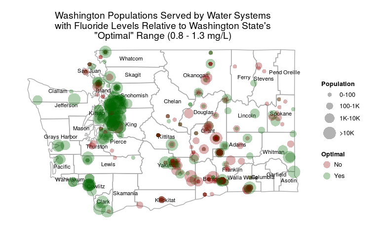 

## All Systems: US Recommended Fluoride Levels

Make a map of populations Served by Drinking Water Systems with natural or treated 
fluoride levels relative to US HHS ("Health Department") and US EPA guidelines.


```r
# Assign US.F.Level based on fluoride concentrations (mgL)
fl$US.F.Level <- cut(fl$mgL, c(-Inf, 0, .7, 2, 4, Inf), 
            labels=c("Unknown", "< HHS .7", "< EPA 2", "< EPA 4", "> EPA 4"))

# Assign remaining US.F.Levels for water systems without concentrations (mgL)
fl$US.F.Level[with(fl, Treatment=="TREATED" | Treatment=="INTERTIED")] <- "< EPA 2"
fl$US.F.Level[with(fl, Treatment=="MIXED")] <- "Unknown"

# Subset the columns we want and remove incomplete observations
fl.us <- select(fl, County, PWSID, SystemName, ResPop, OwnerTypeDesc, 
                 lon, lat, Treatment, Population, US.F.Level)
fl.us <- fl[complete.cases(fl.us),] # This removes the "Unknown" group

# Make the map
wamap <- wamap + geom_point(data=fl.us, inherit.aes=FALSE, 
                aes(x=lon, y=lat, group=US.F.Level, color=US.F.Level, 
                    size=Population, fill=US.F.Level), 
                position=position_jitterdodge(jitter.width=0.1, dodge.width=0.1), 
        alpha=.3) + scale_shape_discrete(solid=TRUE) + 
    scale_size_manual(values = seq(3, 12, by=2)) +
    scale_color_manual(values=c("blue", "darkgreen", "darkorange", "darkred")) +
    guides(colour = guide_legend(override.aes = list(size=5))) + 
    ggtitle(label = paste("Washington Populations Served by Drinking Water Systems",
                          "with Fluoride Levels Colored Relative to",
                          "US HHS Recommendations and US EPA Standards", 
                          sep="\n"))
gmap <- arrangeGrob(wamap, sub = textGrob(data.src, x=0, hjust=-0.1, vjust=0.1,
                   gp = gpar(fontface="italic", fontsize=10)))
gmap
```

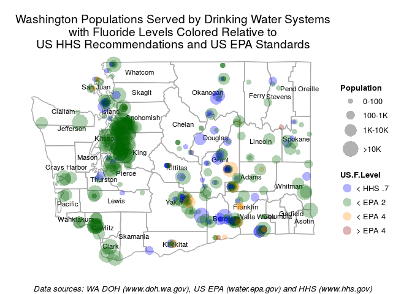 
